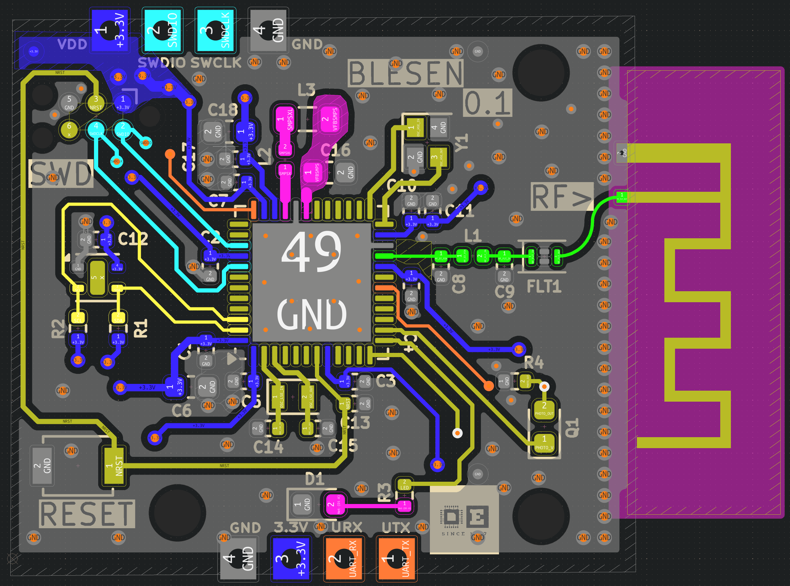

# BLESEN
## Bluetooth Low Energy - Sensor 

A simple playground for testing and developing BLE devices.

This Design has a built in 2.4 Ghz 50 Ohm PCB Antennna and is featuring two different sesnsors.

More to come.

## Schematic
[Schematic](BLESEN-Schematic.pdf)

## PCB

